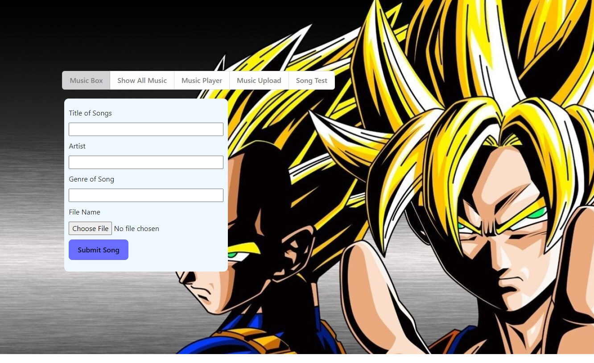

# :musical_note: Music-Box :loud_sound:
featuring JordyJord, Genie-theCoolKat, Josh the unnamed & Dfloaty

## How to Use this Music Box?

$ Upload your songs on the Music Upload tab! 

$ Click choose file, then select the music file that you wish to upload
$ Make sure to enter all details, with the correct capitalisation and spaces. 
$ For uploading multiple songs, please refresh the page before attempting to upload the next song. 

$ View all your uploaded songs in the Show All Music List.
$ Search for songs, and Play, Pause and Stop songs directly from the list!

More features coming soon.

Please submit all bugs or any issues to **josh@gmail.com** with screenshots if possible, and we will look into it!

## :stopwatch: Timeline :stopwatch:

Friday 12/5/23 - Went ahead with idea of Music API app
Tuesday 16/5/23 - Decision made to use supabase database for the player
Friday 19/5/23 - Final tweaks before demo

## Hurdles & Challenges :mute:

$ Attempted to incorporate both Spotify and Soundcloud APIs over the weekend, but had issues with obtaining music tracks to play and OAuth respectively
$ Conflicts during push/pull which occasionally resulted in broken parts and headaches - lots of constant bug fixing, especially towards submission date when the file was getting bigger with more constantly moving parts
$ Having to combine/merge work done separately onto one page/functionality - and getting that to work 

